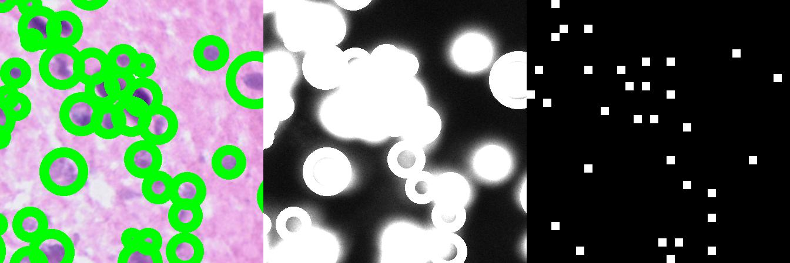

# GeoXenium: An image-gene-geometry multi-modality model

Using multi-modal data—including H&E images, genomic profiles, and geometric spatial
information—we trained a new multi-modal model tailored for 10x Xenium data. This
model, named GeoXenium, enables high-level analysis of spatial genomics data, integrating
diverse data types to provide a more comprehensive understanding of tissue architecture
and gene expression patterns.

